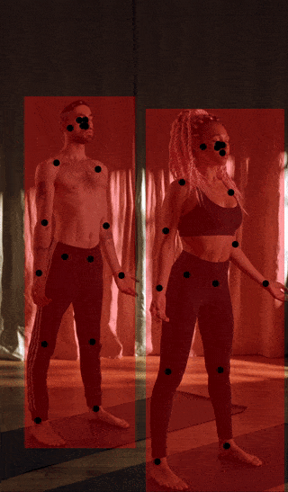

# MoveNet Multipose
[MoveNet](https://blog.tensorflow.org/2021/05/next-generation-pose-detection-with-movenet-and-tensorflowjs.html) multiple body pose detection from Google MediaPipe.



## Installing Function
To use this sample in a custom project, first install [Function](https://github.com/fxnai/fxn3d) by adding the following items to your Unity project's `Packages/manifest.json`:
```json
{
  "scopedRegistries": [
    {
      "name": "Function",
      "url": "https://registry.npmjs.com",
      "scopes": ["ai.fxn"]
    }
  ],
  "dependencies": {
    "ai.fxn.fxn3d": "0.0.12"
  }
}
```

## Predicting Poses in an Image
First, retrieve your access key from [Function](https://www.fxn.ai/settings/developer) and add it in Player Settings:


> [!IMPORTANT]
> After some time, you will need to [add billing info](https://www.fxn.ai/settings/billing) to make predictions with Function.

Next, create a Function client:
```csharp
using Function;
using Newtonsoft.Json;
using Newtonsoft.Json.Linq;

// Create a Function client
var fxn = FunctionUnity.Create();
```

Then predict the poses in an image:
```csharp
// Predict poses
var prediction = await fxn.Predictions.Create(
    tag: "@natml/movenet-multipose",
    inputs: new () { ["image"] = image.ToImage() }
);
var poses = prediction.results[0] as JArray;
```

> [!NOTE]
> [Check out the schema](https://fxn.ai/@natml/movenet-multipose) of the returned poses.

## Requirements
- Unity 2021.2+

## Supported Platforms
- Android API level 24+
- iOS 14+
- macOS 10.15+ (Apple Silicon and Intel)
- Windows 10+ (64-bit only)
- WebGL:
    - Chrome 91+
    - Firefox 90+
    - Safari 16.4+

## Resources
- Join the [Function community on Discord](https://natml.ai/community).
- See the [Function documentation](https://docs.fxn.ai).
- Check out [Function on GitHub](https://github.com/fxnai).
- Email support at [hi@fxn.ai](mailto:hi@fxn.ai).

Thank you very much!