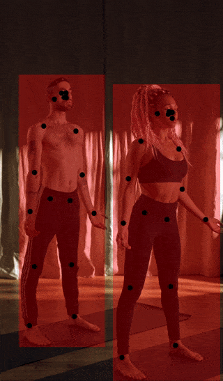

# MoveNet Multipose
[MoveNet](https://blog.tensorflow.org/2021/05/next-generation-pose-detection-with-movenet-and-tensorflowjs.html) multiple body pose detection from Google MediaPipe.

 

## Predicting Poses in an Image
[Install Function](https://docs.fxn.ai) in your Unity project then create a Function client:
```csharp
using Function;
using Newtonsoft.Json;
using Newtonsoft.Json.Linq;

// Create a Function client
var fxn = FunctionUnity.Create();
```

Then predict the poses in an image:
```csharp
// Predict poses
var prediction = await fxn.Predictions.Create(
    tag: "@natml/movenet-multipose",
    inputs: new () { ["image"] = image.ToImage() }
);
var poseObjects = prediction.results[0] as JArray;
```

Finally, parse the detected poses with the `Pose` struct:
```csharp
// Parse the detected poses
Pose[] poses = poseObjects.ToObject<Pose[]>(Pose.Serializer);
```

> [!NOTE]
> [Check out the schema](https://fxn.ai/@natml/movenet-multipose) of the returned poses.

## Requirements
- Unity 2022.3+

## Supported Platforms
- Android API level 24+
- iOS 14+
- macOS 12+ (Apple Silicon and Intel)
- Windows 10+ (64-bit only)
- WebGL:
    - Chrome 91+
    - Firefox 90+
    - Safari 16.4+

## Resources
- Join the [Function community on Discord](https://natml.ai/community).
- See the [Function documentation](https://docs.fxn.ai).
- Check out [Function on GitHub](https://github.com/fxnai).
- Email support at [hi@fxn.ai](mailto:hi@fxn.ai).

Thank you very much!